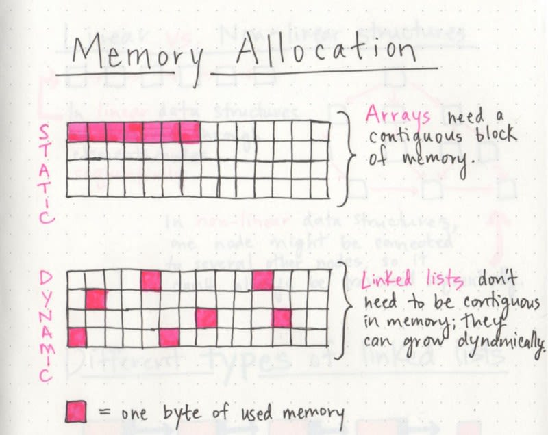

# Linked Lists
***

DS-Recap:
'Data structures' are the different ways that we can organize our data:
* variables
* arrays
* hashes
---

Linked lists are a **linear data structure**. This means that there is a sequence and n order to how they are constructed and traversed.

Think of a linear data structure as a game of _hopscotch_. In order to get to the end of the list, we have to go through all of the items in the list in order, or _sequentially_.

They are the opposite of **non-linear data structures**… where items don't have to be arranged in order… which in turn means that we could traverse the data stucture non-sequentially. 
See: 

---

## Memory Management

Arrays are also a linear data structure. In linked lists and array. **order matters**. 
A big difference between arrays and linked lists lists is the way that they use memory in our machines.

Using dynamically typed languages like Ruby, JavaScript & Python, we don't have to think about how much memory an array uses because there are several layers of abstraction that end up with us not having to worry about memory allocation at all. This doesn't mean allocation isn't happening. 

To understand why linked lists are powerful, we have to get down to the rudimentary level.

When an **array** is created, it needs a cetain amount of memory.
An array of 7 letters would require 7 bytes of memory to represent it.
But, we'd need all of that **memory** in one _contigious block_. That is to say, our computer would need to locate 7 bytes of memory that was free, one byte next to the other, all together, in one place.

A **linked list** doesn't need 7 bytes of memory all in one place. 
One byte could live in one place while the other can be stored in another place in memory altogether.
They don't need to be contiguous; instead, the memory that they use can be scattered throughout. 
See: 

Linked lists are _dynamic_ while contigious based data structures such as arrays are _static_.

A _static data structure_ needs all of its memory to be allocated at the time of creation; 
this means that even if the structure was to grow or shrink in size and elements were to be added or removed, it still _always_ need a given size and _amount of memory_.
If more elements needed to be added to a static data structure and it didn't have enough memory, you'd need to copy the data of that array, for example, and recreate it with more memory, so that you could add elements to it.

A _dynamic data structure_ can shrink or grow in memory. It doesn't need a set amount of memory to be allocated in order to exist, and its size and shape can change, and the amount of memory it needs can change as well.

### What allows linked lists to have its memory _scattered everywhere_?
The answer is _pointers_.

## Parts of a linked list
1. **Nodes**: the individual items/elements in the list.
2. **Head**: the first node in the list.
3. **Tail**: the last node in the list.
4. **Pointer**: a reference to another node.
See: 

The tail of a linked list points to `null`. This is how we know that we've reached the end of the list.

A single node is made up of two parts:
1. **Data**: the value that the node is holding.
2. **Next**: a pointer to the next node in the list.

> A node only knows about what data it contains, and who its neighbor is.

A single node doesn't know how long the linked list is.
It may not necessarily even know where it starts or ends. 
All a node is concerned with is the data it holds, and who its neighbor is.

This is the very reason _why_ a linked list doesn't need a contguous block of memory to exist. Because a single node has the "address" or a reference to the next node, they don't need to live right next to one another the way elements have to in an array.

Instead, we can just rely on the fact that we can traverse our list by leaning on the pointer references to the next node, which means that our machines don't need to block off a single chunk of memory in order to represent our list.

This is also the explanation for why linked lists can grow and shirnk dynamically during a programs execution.
Adding or removing a node with a linked list becomes as simple as rearranging some pointers, rather than copying over the elements of an array.

### Lists for all shapes and sizes

**Singly linked lists** are the simplest type of linked list, based solely on the fact that they only go in one direction. 
There is a _single track_ that we can traverse the list in; we start at the _head_ node, and traverse from the root until the _tail_ node… which points to `null`.

**Doubly linked lists** are a type of linked list that is _bidirectional_. This means that each node has a reference to the next node as well as the previous node.
Because there are two pointers on each node, we can traverse the list in either direction.

If we wanted to be able to hop from one node to its previous node, a doubly linked list prevents the need to traverse the entire list from the head node to the node we're interested in.
However, everything requires space and memory. Doubly linked lists require more memory than singly linked lists because of the extra pointer on each node. 

A **circular linked list** doesn't end with node pointing to a null value.
Instead, it has a node that acts as the tail of the list and the node after the tail node is the beginning of the list. This organization strucutre makes it really easy to add something to the end of the list, because you can begin traversing the list from the tail node, and when you reach the node that points to the head node, you can just update the pointer to point to the new node you're adding.

See: 

## Linked List Operations

1. addFirst -
This method creates a node and prepends it at the beginning of the list.
```javascript
addFirstNode(data) {
  const newNode = new Node(data);

  newNode.next = this.head;
  this.head = newNode;
}
```

2. addLast -
This method creates a node and appends it at the end of the list.
```javascript 
addLastNode(data) {
  const newNode = new Node(data);
  let current = this.head;

  while (current.next !== null) {
    current = current.next;
  }
  current.next = newNode;
}
```

3. traverse -
This method traverses the list and prints the data of each node.
```javascript
traverseList() {
  let current = this.head;

  while (current !== null) {
    console.log(current.data);
    current = current.next;
  }
}
```

4. insertAfter -
This method inserts a node after a given node.
```javascript
insertNodeAfter(data, prevData) {
  let current = this.head;

  while (current !== null) {
    if (current.data === prevData) {
      const newNode = new Node(data);
      newNode.next = current.next;
      current.next = newNode;
      return;
    }
    current = current.next;
  }
}
```

5. insertBefore -
This method inserts a node before a given node.
```javascript
insertNodeBefore(data, nextData) {
  let current = this.head;
  let prev = null;

  while (current !== null) {
    if (current.data === nextData) {
      const newNode = new Node(data);
      if (prev === null) {
        newNode.next = this.head;
        this.head = newNode;
      } else {
        newNode.next = current;
        prev.next = newNode;
      }
      return;
    }
    prev = current;
    current = current.next;
  }
}
```

6. deletion -
This method deletes a node from the list.
```javascript
deleteNode(data) {
  let current = this.head;
  let prev = null;

  while (current !== null) {
    if (current.data === data) {
      if (prev === null) {
        this.head = current.next;
      } else {
        prev.next = current.next;
      }
      return;
    }
    prev = current;
    current = current.next;
  }
}
```

6. reverseList -
This method reverses the list.
```javascript
reverseList() {
  let current = this.head;
  let prev = null;
  let next = null;

  while (current !== null) {
    next = current.next;
    current.next = prev;
    prev = current;
    current = next;
  }
  this.head = prev;
}
```

7. createDeepClone -
This method creates a deep clone of the list. The simplest method is to traverse the original list and copy each node by using the addFirst() method. When this is finished, you will ahve a new list in the reverse order. Finally, we will have to reverse this list.
```javascript
createDeepClone() {
  let current = this.head;
  const cloneList = new LinkedList();

  while (current !== null) {
    cloneList.addFirstNode(current.data);
    current = current.next;
  }

  cloneList.reverseList();
  return cloneList;
}
```

A better way involves using a tail reference for the new list, adding each new node after the last node.
```javascript
createDeepClone() {
  let current = this.head;
  const cloneList = new LinkedList();
  let tail = null;

  while (current !== null) {
    if (cloneList.head === null) {
      cloneList.head = new Node(current.data);
      tail = cloneList.head;
    } else {
      tail.next = new Node(current.data);
      tail = tail.next;
    }
    current = current.next;
  }
  return cloneList;
}
```
---
