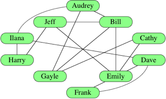
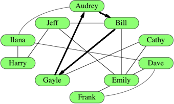
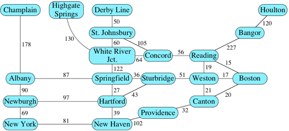
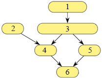

# Graphs
Provided by Khan Academy, here's a way to represent a _graph data structure_ in the form of a social network:


>"A line between the names of two people means that they know each other. If there's no line between two names, then the people do not know each other. The relationship "know each other" goes both ways; for example, because Audrey knows Gayle, that means Gayle knows Audrey.

The names represent the _vertices_ of the graph.
Each line is an _edge_, connecting two _vertices_. 
An edge is denoted by connecting two _vertices_ `u` & `v` by the pair `(u, v)`.

An edge is said is said to be _incident_ on the two vertices it connects. For example, if there is an edge between vertex Audrey and vertex Gayle, this edge is incident on both Audrey and Gayle. 

We also say that the vertices connected by an edge are _adjacent_ or _neighbors_.

The number of edges incident on a vertex is the _degree_ of the vertex.

Because the "know each other" relationship goes both ways, this graph is _undirected_.
An undirected edge `(u, v)` is the same as `(v, u)`.

Later, we'll see _directed graphs_, in which relationships between vertices don't necessarily go both ways.

## Paths and Cycles
Audrey and Frank do not know each other.
If Frank wanted to be introduced to Audrey we'd have to follow, the following path:

Frank -> Emily -> Bill -> Audrey
(Because Frank knows Emily, Emily knows Bill, & Bill knows Audrey)

We say that there is a **path** of three edges between Frank and Audrey.
In fact, that its the most direct way for Frank to meet Audrey; there is no path between them with fewer than three edges. 
We call a path between two vertices with the fewest edges a _shortest path_.

Below is a highlight of the shortest path:


When a path goes from a particular vertex back to itself, thats a _cycle_.
The social network contains many cycles; one of them goes from Audrey to Bill, to Emily to Jeff, to Harry to Llana, and back to Audrey.

Below, is an illustration of a _cycle_ path.



## Weights (Numeric Values On Edges)
Sometimes we put numeric values on the edges.
For example in the social network example, we might use values to indicate how _well_ two people know eachother.

To bring in another example, let's represent a road map as a graph.
Assuming that there are no one-way streets, a road map is also an undirected graph, with cities as vertices, roads as edges, and the values o edges indicating the distance of each road.

Here's a roadmap, not to scale, of some of the interstate highways in the northeastern U.S., with distances next to edges:


The general term that we use for a number that we put on an edge is its _weight_, and a graph whose edges have weights is a _weighted graph_.

In the case of a road map, if you want to find the shortest route between two locations, you're looking for a path between two vertices with the minimum sum of edge weights over all paths between the two vertices. 
As with weighted graphs, we call such a path a _shortest path_.
For example, the shortest path in this graph from New York to Concord goes from:

New York -> New Haven -> Hartford -> Sturbridge -> Weston -> Reading -> Concord

Totaling 289 miles.

### Directed & Acyclic Graphs
As briefly mentioned above, the relationship between vertices does not always go both ways.
In a road map, for example, there could be one-way streets.
Or here's a graph showing the order in which a goalie in ice hockey could get dressed:


Now edges, shown with arrows are _directed_, and we have a _directed graph_.
Here, the directions show which pieces of equipment must be put on before other pieces.
For example, the edge from chest pad to sweater indicates that the chest pad must be put on before the sweater.
The numbers next to the vertices show one of the many possible orders in which to put on the equipment, so that the undershorts go on first, then socks, then compression shorts, and so on, with the blocker going on last.
This particular directed graph has no cycles.
We call such a graph a _directed acyclic graph_, or _dag_ (stemmed from the terms abbreviation).

Of course, we can have _weighted directed graphs_ such as road maps with one-way streets and road distances.

We use different terminology with directed edges.
We say that a directed edge _leaves_ one vertex and _enters_ another.

For example, one directed edge leaves the vertex for chest pad and enters the vertex for sweater. 
If a directed edge leaves vertex `u` and enters vertex `v`, we denote it by `(u, v)`, and the order of the vertices in the pair matters.
The number of edges leaving a vertex is its _out-degree_.
The number of edges entering a vertex is its _in-degree_.

## Graph Sizes
When working with graphs, its helpful to be able to talk about the set of vertices and the set of edges.
We usually denote the vertex set by `V` and the edge set by `E`.

When we represent a graph or run an algorithm on a graph, we often want to use the sizes of the vertex and edge sets in asymptotic notation.

For example, suppose that we want to talk about a running time that is linear in the number of vertices.
Strictly speaking, we should say that it's `θ(|V|)`

Using the notation `|•|` to denote the size of a set. 
But using this set-size notation in asymptotic notation is cumbersome, and so we adopt the convention that in asymptotic notation, and only in asymptotic notation, we drop the set-size notation with the understanding that we're talking about set sizes.
So instead of writing `θ(|V|)`, we just write `θ(V)`.
Similarly, instead of writing `θ(lg |E|)`, we write `θ(lg E)`  

## Representing Graphs
There are several ways to represent graphs, each with its advantages and disadvantages.
Some situations, or algorithms that we want to run with graphs as input, call for different representations.

We will look at three criteria.
1. How much memory or space we need in each representation.
  1a. We can use asymptotic notation for this. 
  1b. It's a way to characterize functions, and a function can describe running time, an amount of space required, or some other resource.
2. How long it takes to determine whether a given edge is in the graph
3. How long it takes to find the neighbors of a given vertex.

It is common to identify vertices not by name but instead by a number.
That is, we typically number the `|V|` (set of vertices) vertices from `0` to `|V| - 1`.

Below is a representation of the social network graph with its 10 vertices identified by numbers rather than names:


### Edge Lists
One simple way to represent a graph is just a list, or array, of `|E|` edges which we call an _edge list_.
To represent an edge, we just have an array of two vertex numbers, or an array of objects containing the vertex numbers of the vertices that the edges are incident on.
If edges have weights, add either a third element to the array or more information to the object, giving the edge's weight. 
Since each edge contains just two or three numbers, the total space for an edge list is θ(E).

For example, here's how we represent an edge list in JavaScript for the social network graph: 
``` javascript
const graph = [ 
  [0,1], 
  [0,6], 
  [0,8], 
  [1,4], 
  [1,6], 
  [1,9], 
  [2,4], 
  [2,6], 
  [3,4], 
  [3,5],
  [3,8],
  [4,5],
  [4,9], 
  [7,8], 
  [7,9] 
];
```

Edge lists are simple, but if we want to find whether the graph contains a particular edge, we have to search through the edge list.
If the edges appear in the edge list in no particular order, that's a linear search through `|E|` edges.

A question to ponder:
How can you organize an edge list to make searching for a particular edge take O(lg E) time?
The answer is a little tricky. 

### Adjacency Matrices
For a graph with `|V|` vertices, an _adjacency matrix_ is a `|V| x |V|` matrix of 0s and 1s where the entry in row `i` and column `j` is 1 if and only if the edge `(i, j)` is in the graph.
If you want to indicate an edge weight, put it in the row `i`, column `j` entry, and reserve a special value (perhaps `null`) to indicate an absent edge.

Here's the adjacency matrix for the social media graph:


In JavaScript, we represent this matrix by:

``` javascript
const adjacencyMatrix = [ 
  [0, 1, 0, 0, 0, 0, 1, 0, 1, 0],
  [1, 0, 0, 0, 1, 0, 1, 0, 0, 1],
  [0, 0, 0, 0, 1, 0, 1, 0, 0, 0],
  [0, 0, 0, 0, 1, 1, 0, 0, 1, 0],
  [0, 1, 1, 1, 0, 1, 0, 0, 0, 1],
  [0, 0, 0, 1, 1, 0, 0, 0, 0, 0],
  [1, 1, 1, 0, 0, 0, 0, 0, 0, 0],
  [0, 0, 0, 0, 0, 0, 0, 0, 1, 1],
  [1, 0, 0, 1, 0, 0, 0, 1, 0, 0],
  [0, 1, 0, 0, 1, 0, 0, 1, 0, 0] 
];
```

Looking at the social network illustration where we have replaced the names with numbers, we can see that there is an edge that is incident on vertices 0 and 6. 
Because this is an edge at (0, 6) or (6, 0), the entry in our matrix at those points is `1`. 

With an adjacency matrix, we can find out whether an edge is present in constant time, by just looking up the corresponding entry in the matrix. 
For example if the adjacency matrix is named `adjacencyMatrix` (like above), then we can query whether edge `(i, j)` is in the graph by looking at graph[i][j].

##### Disadvantages of an Adjacency Matrix
1. It takes `θ(V^2)` space (exponential), even if the graph is _sparse_ (relatively few edges). In other words, for a sparse graph, the adjacency matrix is mostly 0s, and we use lots of space to represent only a few edges.

2. If you want to find out which vertices are adjacent to a given vertex `i` you have to look at all `|V|` entries in row `i` even if only a small number of vertices are adjacent to vertex `i`. 

For an undirected graph, the adjacency matrix is **symmetric**: the row `i`, column `j` entry is `1` if and only if the row `j`, column `i` entry is `1`.
For the adjacency matrix need not be symmetric. 

### Adjacency Lists
Representing a graph with _adjacency lists_ combines adjacency matrices with edge lists. 
For each vertex `i`, store an array of the vertices adjacent to it.
We typically have an array of `|V|` adjacency lists, one adjacency list per vertex.

Here's an adjacency-list representation of the social network graph:


In JavaScript, we represent these adjacency lists by:

```javascript
const adjacencyList = [ 
  [1, 6, 8],
  [0, 4, 6, 9],
  [4, 6],
  [4, 5, 8],
  [1, 2, 3, 5, 9],
  [3, 4],
  [0, 1, 2],
  [8, 9],
  [0, 3, 7],
  [1, 4, 7] 
];
```

Vertex numbers in an adjacency list are not required to appear in any particular order, though it is often convenient to list them in increasing order, as in this example.

We can get to each vertex's adjacency list in constant time, because we just have to index into an array.
To find out whether an edge `(i, j)` is present in the graph, we go to `i`'s adjacency list in constant time and then look for `j` in `i`'s adjacency list.

#### How long do Adjacency Lists take?
`θ(d)`, where `d` is the _degree_ of vertex `i`, because thats how long `i`'s adjacency list is.

The degree of vertex `i` could be as high as `|V| - 1` (if `i` is adjacent to all the other `|V| - 1` vertices) or as low as `0` (if `i` is isolated, with no incident edges).

In an undirected graph, vertex `j` is in vertex `i`'s adjacency list if and only if `i` is in `j` adjacency list. 

If the graph is weighted, then each item in each adjacency list is either a two-item array or an object, giving the vertex number and the edge weight. 

You can use a _for-loop_ to iterate through the vertices in an adjacency list.
For example, suppose that you have an adjacency-list representation of a graph in the variable `graph`, so that `graph[i]` is an array containing the _neighbors_ of vertex `i`.
Then, to call a function, `doSomeShit` on each vertex adjacent to vertex `i`, you could use the following javascript code:
``` javascript
for (let j = 0; j < graph[i].length; j++) {
  doSomeShit(graph[i][j]);
}

// If the _double-subscript_ notation confuses you, you can think of it this way:

const vertex = graph[i];
for (let j = 0; i < vertex.length; j++) {
  doSomeShit(vertex[j]);
}
```

#### How much space do Adjacency Lists take?
We have `|V|` lists, and although each list could have as many as `|V| - 1` vertices, in total, the adjacency lists for an _undirected graph_ contain `2|E| elements`.Why `2|E|`? Each edge `(i,j)` appears exactly twice in the adjacency lists. Once in `i`'s list and once in `j`'s list, and there are `|E|` edges. For a _directed graph_, the adjacency lists contain a total of `|E|` elements, one element per directed edge. 

### Space and Time For Each Method of Representation
Assume `E` is the number of edges, `V` is the number of vertices and `d` is the degree of each vertex.

**SPACE**
1. _edge list_ - `O(E)`
2. _adjacency matrix_ - `O(V^2)`
3. _adjacency list_ - `O(V + E)`

**TIME** 
(to search for a particular edge through each way of storing a directed graph)
1. _edge list (unordered)_ - `O(E)`
2. _adjacency matrix_ - `O(1)`
2. _adjacency list_ - `O(d)`

### Khan Exercise Example


```javascript
const edgeList = [
  [1, 3],
  [2, 4],
  [3, 4],
  [3, 5],
  [4, 6],
  [5, 6]
];

const adjacencyMatrix = [
  [0, 0, 1, 0, 0, 0],
  [0, 0, 0, 1, 0, 0],
  [0, 0, 0, 1, 1, 0],
  [0, 0, 0, 0, 0, 1],
  [0, 0, 0, 0, 0, 1],
  [0, 0, 0, 0, 0, 0]
];

const adjacencyList = [
  [3],
  [4],
  [4, 5],
  [6],
  [6],
  []
];

```
