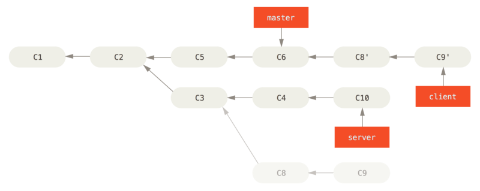

# Git In, We're going for a ride.
**Overview**
* Review of Git Basics
* History-changing Git commands
* Different ways of changing history
* Using remotes to change history
* Dangers of history-changing operations
* Pointers

---

## Basics Review: Commits, Branches and Pointers

### What are Commits?
Commits are snapshots.
Every time you type in `git commit`, your computer is taking a figurative _picture_ of all the file contents that have been stage with `git add .`
In other words, your entire tracked workspace gets copied. 

### So what is a branch?
One might visualize a branch as a group of commits; However, this isn't the case.
**A branch is actually a pointer to a single commit!**
This leads to the question, "If a branch is just a finger pointing to a single commit, how does that single commit know about all the commits that came before it?"
The answer is that each commit _also_ a pointer that points to the commit that came before it (similar to a linked list data structure). 

Lets think back to our use of `git rebase -i HEAD~2`. 
If you can remember, this command lets us edit the last two commits.
How did Git know which two commits to edit?
**Pointers!**
We start at `HEAD`, which is a special pointer for keeping track of the branch you're currently on.
`HEAD` points to our most recent commit in the current branch. That commit points to the commit made directly before it, which we can call commit two.
That's how `git rebase -i HEAD~2` starts with a HEAD pointer, and then follows subsequent pointers to find which two commits to edit.

#### `HEAD` traversal via `^`
…(i.e., `HEAD^2`) uses pointers in a non-linear way. Instead of pointing only to the previous commits of the same branch, when there are merge commits, `HEAD^n` includes pointers for both parents. The first pointer being the branch we originally merged into and the second, the 'feature' branch itself.

✨ Example:
Lets say we have a main branch with 5 commits, `A`, `B`, `C`, `D` and `E`.
Lets also say we had a feature branch called `F` from `A` that we eventually merged into `B`. 
Lets also say we had a feature branch called `G` from `C` that we eventually merged into `D`.

Here's the visual:

`A` - `F`
  \   /
   `B` - `G` - `E`
     \
     `C`


How would `HEAD^` traverse starting from `HEAD`, `E`?

1. `HEAD` = `E` (Given)
1. `HEAD^` = `D`
2. `HEAD^2` = `B`
3. `HEAD^3` = `A`
4. `HEAD^4` = `F`


This is because `HEAD^` refers to the first parent of the current commit, `HEAD^2` refers to the second parent, and so on. When you're on commit `E`, `D` is the first parent (since `E` was created from `D` in the main branch), `B` is the second parent (since `E` was also created from `B` when merging the `F` branch), and so on.

---

## HEAD vs Branch vs Commit
1. **HEAD:**
   - In Git, `HEAD` is a special pointer that points to the current branch or directly to a commit (in a detached state).

2. **Branch:**
   - A branch is a pointer to a specific commit. It represents a line of development in the repository.

3. **Commits:**
   - Commits are linked in a sequence, where each commit points to its parent commit(s). A branch points to the latest commit in this sequence.

### HEAD Points to a Branch
When you are on a branch, `HEAD` points to that branch.

``` bash
A -- B -- C (main)
           ^
          HEAD
```
- `HEAD` is pointing to the `main` branch.
- The `main` branch is pointing to commit `C`.

### Branch Points to the Latest Commit
A branch is a pointer to the latest commit in the line of commits.

``` bash
A -- B -- C (main)
           ^
          HEAD
```
- The `main` branch points to commit `C`.
- Commit `C` points back to commit `B`, and commit `B` points back to commit `A`.

### Detached HEAD State
When `HEAD` is detached, it points directly to a specific commit instead of a branch.

``` bash
A -- B -- C (main)
           ^
          HEAD (detached)
```
- `HEAD` is pointing directly to commit `C`.
- The `main` branch remains pointing to commit `C`.

### Visualizing with More Branches
Let's add another branch for clarity:

``` bash
A -- B -- C (main)
      \
       D -- E (feature)
```
- `HEAD` points to `main`, which points to `C`.
- The `feature` branch points to commit `E`.

### Summary
- `HEAD` points to the current branch (or commit in detached state).
- A branch points to the latest commit in that branch.
- Commits are linked in a sequence, with each commit pointing to its parent commit(s).

By understanding these relationships, you can see how `HEAD`, branches, and commits interact in a Git repository.

---

## Changing The Last Commit: `git commit --amend`
Let's say we forgot a file in our most recent commit. 
As long as we haven't pushed our commit anywhere, we can amend it. 

In the case of forgetting a file… first we would stage it via `git add <file-name>`… then we would run `git commit --amend`. 

This would open our code editor where we can update the message associated with the commit if we so choose.

If you want to change the commit message directly without opening an editor, you can use `git commit --amend -m 'new message'`, but this will replace the entire commit message, not just append to it.

It doesn't _change_ our commit. It _replaces_ it. 
This is why, as previously mentioned, you should only amend commits that haven't been pushed anywhere because you could potentially destroy a commit other developers are working on.
It is imperative to _rewrite history_ in a safe and responsible manner.

---

## Changing Multiple Commmits: `git rebase`
**VSCode Tutorial**

`git rebase` works by:
  1. Going to the common ancestor of the two branches (the one you’re on and the one you’re rebasing onto).
  2. Getting the diff (differences) introduced by each commit of the branch you’re on.
  3. Saving those diffs to temporary files.
  4. Resetting the current branch to the same commit as the branch you are rebasing onto.
  5. Finally, applying each change in turn.

  * A typical scenario is rebasing a topic branch onto the main branch… where the commits of your topic branch are replayed/applied to the main branch. You'd call `git rebase main` from the topic branch.

**To perform a fast-forward merge from Step 5:**
  1. Checkout the branch that was rebased onto (typically the main branch) using `git checkout main`.
  2. Merge the sub-branch/feature/experiment using `git merge sub-branch`.

  This updates the main branch to include all the changes from the feature branch, effectively moving the main branch’s pointer to the latest commit of the feature branch, assuming there are no conflicts and it can be fast-forwarded.

  A `git merge` can result in the same commit becoming the master; however, with rebase, checking `git log` results in a linear history: appearing as if all the work happened in series, even when it originally happened in parallel.

### Interesting Rebase Scenario
1. 
  - In the figure above we have a branch that diverges from our `master` branch at commit `C2` that has some server-side functionality to our project. We made one commit on that branch initially.
  - We also have another branch, `client`, that diverges from the `server` branch at commit `C3` (which has client side changes). The initial commit from this branch is `C8`. We make a commit here before anything else.
  - We go back to the `server` branch and add another commit, `C10`.   
  
  a. **Merge client-side changes into mainline, bypassing server-side updates**:
    `git rebase --onto master server client`

    This basically says "take the `client` branch, figure out the patches (later commits of the branch) since it diverged from the `server` branch, and replay these patches in the `client`  branch as if it was based directly off the `master` branch instead."
      * `--onto master`: specifies the new base branch we are rebasing onto (`master` in this case).
      * `server`: this is the upstream branch from which `client` diverged. Git will dertermine the changes on `client` since it branched off `server`.
      * `client`: this is the branch you are currently on and want to rebase.

    **Client Rebase Result:**
    
  
  b. **Fast-forward `master` branch to include `client` branch**
    `git checkout master && git merge client`

    **Client Merged Result:**
    

  c. **Pulling in the `server` branch (into main)**
    We can rebase the `server` branch onto the `master` branch without having to check it out first by running:

    `git rebase <basebranch> <topicbranch>` 

    …which checks out the topic branch (in this case, `server`) for you and replays it onto the base branch (`master`). 

    This is what this looks like with our example:
     `git rebase master server`.

    **Server Rebase Result:**
    

  d. **Fast-forward the base branch to include `server` branch** 
    `git checkout master && git merge server`

    Also, at this point we can remove the `client` and `server` branches via: 

    `git branch -d client && git branch -d server` 

    …because all the work is integrated and we don't need them anymore. 

    This leaves our final commit history:
    

---

### Another Interesting Scenario (Rebase drawbacks)
One rule:
**Do not rebase commits that exist outside your repository and that people may have based work on.**

> In other words, rebase local changes ebfore pushing to clean up _your_ work, but never rebase anything that you've pushed somewhere. If you follow this rule… you'll be chillin'; Otherwise, several kittens will, in fact, experience a simultaneous existential crisis. We all know what happens post felis catus existential crisis'. 💭

When you `rebase` stuff, you're abandoning existing commits and creating new ones that are similar but different. If you push commits somewhere and others pull them down and base work on them, and then you rewrite those commits with `git rebase` and push them up again, your collaborators will have to re-merge their work and things will get messy when you try to pull their work back into yours.
See `The Perils of Rebasing` at: https://git-scm.com/book/en/v2/Git-Branching-Rebasing#rbdiag_g 

Following the example in `The Perils of Rebasing` link above…

If you find yourself in a sitation where someone else working on the same project had originally created a `merge` commit that you pulled into your branch (via `merge` as well).

If this coworker went back and rebased their work instead, using `git push --force` {1} to overwrite the history on the server (abandoning the commits you have based your work on).

Performing a `git pull` {2} creates a new merge commit on your branch. This includes _both lines_ of history (the merge from the original merge commit and the merge from the rebase). 

Running `git log` will result in seeing two commits that have the same author, date and message… which is confusing. 
Furthermore, if you push this history back up to the server, you'll reintroduce all those rebased commits to the central server… confusing people further. 

Of course, the developer would prefer if those commits were not in the history… the reason why they rebased in the first place. Fortunately there is some more of that Git maagic that can help. See below.

**Resolving the issue above: Rebase on Rebase!**
If someone on your team force pushes changes that overwrite work that you've based work on, your challenge is to _figure out what is yours and what they've rewritten_.

In addition to the commit SHA-1 checksum, Git also calculates a checksum that is based just on the patch introduced with the commit. This is called a **patch-id** {3}. 

If you pull down work that was rewritten and rebase it on top of the new commits from your partner Git can often successfully figure out what is uniquely yours and apply them back on top of the new branch.

For instance, in the _scenario above_, if instead of doing a merge to pull the new rebased changes after already merging the previous history that was overwritten, we run:

`git rebase teamone/master` (from our branch)

When this is run, Git will:
  1. Determine what work is unique to our branch.
  2. Determine which are not merge commits.
  3. Determine which have not been rewritten into the target branch.
  4. Apply/replay those commits to the top of the master.

So you're **rebasing on top of the rebase!**

💭 {1} `git push --force` forcibly updates a remote repository with changes from your local repository. It is typically used to overwrite the remote branch with your local branch, even if the remote branch has commits that are not present in your local branch.

💭 {2} `git pull` (essentially a combination of `git fetch` {a} and `git merge`) performs a `merge` by default. You can have it perform a `rebase` instead by adding a `--rebase` flag after the `pull`. To make rebasing the default behavior `git pull`, you can set the configuration: `git config --global pull.rebase true`.
  {a} `git fetch` is a command used in Git to download commits, files and references from a remote repository and updates your remote-tracking branches, allowing you to review the changes before integrating them via `git diff main origin/main`, followed by `git merge origin/main` (merges the changes from `origin/main` into your local `main` branch).

💭 {3} **patch**: refers to the set of changes introduced by a commit (addtions, deletions, and modifications to files in the repository).
A patch ID is a unique identifier for this set of changes. 

Here's a breakdown:
  * **Commit SHA-1 Checksum**:
    - This is a unique identifier for the entire commit, which includes the changes (patch), the commit message, the author information, the parent commit(s), and other metadata.

  * **Patch**:
    - As mentioned above… the patch is the difference (diff) between the content of files in one commit and its parent commit.

  * **Patch-id**:
    - A unique checksum calculated based on just the content of the patch itself, not including metadata like the commit message or author information. This allows git to identify identical changes even if they are in different commits. Patch-ids are useful in scenarios like;
      * *Detecting duplicate patches*:
        - Even if two different commits have different SHA-1 checksums, if their patch-ids are the same, they introduce the same changes (like when rebasing onto a forcibly pushed rebase branch that was originially a merge).
      * *Cherry-picking*: Applying the same patch to different branches.

---

### Interactive Rebase: `git rebase -i` 
`git rebase -i` is a command which allows us to `-i`nteractively stop after each commit we're trying to modify, and then make whatever changes we wish. 
We tell this command which is the last commit we want to edit.

For example, `git rebase -i HEAD~2` allows us to edit the last two commits.

#### `pick`, `edit` & `drop`
When the tool has opened up in VS Code, and we wish to edit one of our commits, we change the word `pick` to be `edit` for the appropriate commit.
This allows us to amend the commit in the command line by running `git commit --amend`, which will open up in the editor and allow us to make our change. 
Once satisfied with our changes" we run `git rebase --continue`.
Running `git log` post change will allow us to see our handiwork.

If you have to rebase commits in a shared repository, make sure that it is done for a very good reason that your coworkers are aware of. 

If we wanted to remove a commit, we would remove it from the list via `drop`, and if we wanted to change their order, we would change their position in the list. 

#### `reflog`
If we accidentally drop a commit during an interactive rebase, the commit is immediately lost.
Git keeps a reference to the commit for a while (typically a couple of weeks) in a mechanism called the **reflog**. 
This allows use to recover the commit if needed.
We use the reflog to find the commit's SHA {1} and then reset your branch to that commit. 

The general steps are:
  1. Find the SHA of the dropped commit using `git reflog`.
  2. Reset your branch to that commmit using `git reset --hard <SHA>`.
Be cautious with `git reset --hard`, as it will remove any changes in your working directory and staging area. 
If you're unsure, you can use `git reset --soft <SHA>` to reset the branch to the dropped commit without affecting your working directory or staging area.

{1} SHA - Secure Hashing Algorithm:
 - The 40-character string of hexadecimal characters (0-9 and a-f) generated by the SHA-1 cryptographic hash function.

#### `squash`
Using `squash` for our commits is a very handy way of keeping our Git history tidy. 
It's important to know how to `squash` because this process may be the standard on some development teams.
Squashing makes it easier for others to understand the history of your project. 

What often happens when a feature is merged, is we end up with some visually complex logs of all the changes a feature branch had a main branch. These commits are important while the feature is in development, but aren't really necessary when looking thorugh the entire history of your main branch. 

Lets say we have 3 commits in the current repository and we want to `squash` the second commit into the first commit on the list.

First we rebase all the way back to our root commit by typing `git rebase -i --root`.
Now what we'll do is `pick` that first commit, as the one which the second commit is being `squash`ed into.
Then we select `squash` for the second commit.
This gives us the opportunity to rename the conjoined commit.
`git log` after should reveal 2 commits. The new root and the what was previously the third commit.

---

## Git Review & Splitting up a commit: `git reset`
**(For Head^ vs Head~1, see here: )**

`git reset HEAD^` resets the current branch by pointing `HEAD` at the commit right before it.

So lets say our HEAD commit added 2 files. Running `git reset HEAD^` gives us the ability to add and stage the files individually.

At the same time, `git reset` also updated the index (the staging area) with the contents of wherever `HEAD` is now pointed. 

So your staging area was also reset to what it was at the prior commit.
This allowed us to add and commit both files separately.

Now, let's say want to move where HEAD points to but don't want to touch the staging area. If we want to leave the index alone, you can use `git reset --soft`.
This would only perform the first part of `git reset` where the HEAD is moved to point somewhere else.
You can think of `git reset --soft` as a more powerful amend. 
Instead of changing the last commit, you can go back multiple commits and combine all the changes included in them into one commit… a squashing!
Keep in mind that from the branches perspective, it looks as if the commits that were squashed never existed.
The SHA's for the squashed commits are still around in the repository (accessible via `reflog`) but they are no longer referenced by any branch and eventually will be garbage collected by Git if they are not referenced by any other commit, branch, tag, or reflog entry (reflog expiry default is 90 days).

`git reset --hard` performs all the steps of `git reset`, moving `HEAD` and updating the index (staging area), but it _also_ updates the working directory.
This is important to note because it can be dangerous as it can potentially destroy data. A hard reset overwrites the files in the working directory to make it look exactly like the staging area of wherever `HEAD` ends up pointing to.

Like `git commit --amend`, a hard reset is a destructive command which overwrites history.
This doesn't mean you should completely avoid it if working with shared repositories on a team with other developers.
You should however, make sure you _exactly why_ you're using it, and that your coworkers are also aware of how and why you're using it.

### The Three Trees
An easier way to think about `reset` and `checkout` is through the mental frame of Git being a content manager of three different trees.
By "tree" here, we really mean "collection of files", not specifically the data structure.
There are a few cases where the index doesn't exactly act like a tree… but for our purposes it is easier to think about it this way for now.

Git is a system manages and manipulates three trees in its normal operation:

| Tree              | Role                              |
|-------------------|-----------------------------------|
| HEAD              | Last commit snapshot, next parent |
| Index             | Proposed next commit snapshot     |
| Working Directory | Sandbox                           |


#### The HEAD
HEAD is the pointer to the current branch reference, which is in turn a pointer to the last commit made on that branch. That means HEAD will be the parent of the next commit that is created. 
It's generally simplest to think of HEAD as the snapshot of **your last commit on that branch.**

In fact, it's pretty easy to see what that snapshot looks like. Here's an example of getting the actual directory listing and SHA-1 checksums for each file in the HEAD snapshot:
``` bash 
$ git cat-file -p HEAD # {1}
tree cfda3bf379e4f8dba8717dee55aab78aef7f4daf
author Deez Nuts  1301511835 -0700
committer Deez Nuts  1301511835 -0700

initial commit message 

$ git ls-tree -r HEAD # {2}
100644 blob a906cb2a4a904a152...   README
100644 blob 8f94139338f9404f2...   Rakefile
040000 tree 99f1a6d12cb4b6f19...   lib
```

The Git `cat-file` and `ls-tree` commands are **plumbing** commands that are used for lower level things and not really used in day-to-day work, but they help us see what's going on here.

💭 {1} The command `git cat-file -p HEAD` is used to display the content of the commit object referenced by `HEAD`. 
Heres a breakdown of what it does:

  * `git cat-file`
    - This command is used to provide content or type information for repository objects.
    - It can be used to examine the contents of objects in the Git database.
  * `-p`
    - This option stands for "pretty-print".
    - When used with `git cat-file`, it formats the content of the object in a human-readable way.
  * `HEAD`
    - This is a reference to the current commit.
    - In Git, `HEAD` points to the latest commit in the currently checked-out branch.

  * **Combined Command**
    * `git cat-file -p HEAD` pretty-prints the content of the commit object pointed to by `HEAD`. 
    * This will show details such as the _commit message_, _author_, _date_, and the _tree object_ that represents the directory structure of the project at the time of that commit.
  
  * **Output Explained**
``` bash
tree 83baae61804e65cc73a7201a7252750c76066a30
parent dfcbad7e8fd4e47edb1404dbcb33d72af984c1ae
author John Doe <john.doe@example.com> 1623760012 +0200
committer John Doe <john.doe@example.com> 1623760012 +0200

Commit message
```
  * **tree:** The SHA-1 hash of the tree object for this commit, which represents the state of the directory structure and the content of the files at the time of the commit.
  * **parent:** The SHA-1 hash of the parent commit. A commit can have zero (initial commit), one (regular commit), or multiple (merge commit) parent references.
  * **author:** the name and email of the author, along with the timestamp of when the commit was originally made. 
  * **commmitter:** the name and email of the author, along with the timestamp of the commit. The author and committer can be different in cases like patches applied by a maintainer.
  * **Commit message:* the message describing the changes mde in this commit.

  * **Practical Use** 
  This command is useful for inspecting the details of a commit, understanding the changes introduced, and verifying the commit metadata.

💭 {2} The command `git ls-tree -r HEAD` is used to list the contents of the tree object (directory structure) of the commit referenced by `HEAD` recursively. 
Here's a breakdown of what it does:

  * `git ls-tree`
    - This command is used to list the contents of a tree object, showing the names, types, and modes of its contained objects (blobs, trees, and submodules).
  * `-r`
    - This option stands for "recursive".
    - When used with `git ls-tree` it lists the contents of the tree object recursively, meaning it will traverse subdirectories and list their contents as well.
  * `HEAD`
    - Reference to the latest commit. 

  * **Combined Command**
    * `git ls-tree -r HEAD` lists all files and directories in the current commit, including their paths, types (blob for files, tree for directories), and SHA-1 hashes, recursively.

  **Output Explained**
``` bash
100644 blob a7f5f35426b927411fc9231b56382173e2a80b6d    .gitignore
100644 blob 5f0c15442f4086d10bf12b6209f896b60a4055b9    README.md
100644 blob 3b18e1de6757b11f4e48dddfce09f11b37228820    src/main.js
100644 blob a35ee8d8b4765c00b0e25f0492cb1b94b117b3bf    src/utils/helper.js
040000 tree a8c03cb0d4e70e9ae6b5c5d6220f1d5e0f7f4d41    src/utils
```

  * **100644:** the file mode (permissions) for regular files.
  * **blob:** indicates that the object type is a file.
  * **tree:** indicates that the object type is a directory.
  * **SHA-1 hash:** the unique identifier for the object.
  * **Path** the path to the file or directory relative to the repository root.

  * **Practical Use**
  This command is useful for:
    - Inspecting the directory structure of a commit.
    - Verifying the files and directories present in a specific commit.
    - Getting the SHA-1 hashes of files and directories for further inspection or comparison.
    - Provides a comprehensive view of the repository's state at a particular commit, making it valuable for debugging, auditing, and understanding changes over time. 

#### The Index
The **index** is your _proposed next commit_.
We've also been referring to this concept as Git's "Staging Area" as this is what git looks like when you run `git commit`.

Git populates this index with a list of all the file contents that were last checked out into your working directory and what they looked like when they were originally checked out.
You then replace some of those files with new versions of them, and `git commit` converts that into the tree for a new commit.

``` bash
git ls-files -s # {1}
100644 a906cb2a4a904a152e80877d4088654daad0c859 0	README
100644 8f94139338f9404f26296befa88755fc2598c289 0	Rakefile
100644 47c6340d6459e05787f644c2447d2595f5d3a54b 0	lib/simplegit.rb
```

The index is not _technically_ a tree structure - it's actually implemented as a _flattened manifest_ (conceptually) - but for our purposes, it's close enough.

💭 {1} The `-s` flag in the command `git ls-files -s` stands for "stage". When used with `git ls-files`, it shows detailed information about the files in the index (staging area). 
Here's a breakdown:
  * `git ls-files` is used to show information about files in the index (the mf staging area bitch). It simply lists the paths of the files.
  * `-s` (or `--stage`) provides detailed information about the index, including the mode, the object name (SHA-1 hash), and the stage number for each file. 

  **Output Explained**
``` bash
100644 e69de29bb2d1d6434b8b29ae775ad8c2e48c5391 0    .gitignore
100644 d670460b4b4aece5915caf5c68d12f560a9fe3e4 0    README.md
100644 5f0c15442f4086d10bf12b6209f896b60a4055b9 0    src/main.js
100644 3b18e1de6757b11f4e48dddfce09f11b37228820 0    src/utils/helper.js
```

  * **10644:** the file mode (as mentioned above) for regular files
  * **SHA-1 hash:** the unique identifier for the object.
  * **Stage number:** the stage number of the file _(typically 0 for files that are not involved in a merge conflict)_.
  * **Path:** the path to the file relative to the repository root.

  * **Practical Use**
  This command is useful for:
    - Inspecting the details of files in the staging area.
    - Debugging issues related to the index, such as understanding the state of files during a merge conflict.
    - Verifying the exact versions of files that are staged for the next commmit.
    - The `-s` flag with `git ls-files` provides a detailed view of the staging area, which can be helpful when we need more information other than the filenames and want to understand the specifics of the staged content. 

#### The Working Directory
Also referred to as the "working tree".
The other two trees store their content in an efficient but unconventional manner… inside the `.git` folder.
The working directory unpacks them into actual files, which makes it much easier for you to edit them.
Think of the working directory as a **sandbox**, where you can try changes out before adiing them to your staging area (index) and then to history.

For example:
``` bash
my-project/
├── .git/
│   ├── objects/
│   ├── refs/
│   ├── config
│   ├── HEAD
│   └── ...
├── src/
│   ├── main.js
│   ├── utils.js
│   └── ...
├── README.md
└── .gitignore
```

#### The Workflow
Git's typical workflow is to record snapshots of your project in successively better states, by manipulating these three trees.

When we run `git init` in a directory, this creates the `.git` directory repository with a `HEAD` reference that points to the unborn `master` branch.

Lets say this directory has a single file in it called `file.txt`.
Running `git add file.txt` will place the file in the index (staging area) located in the git repository (`.git/index` directory).

Also, note that `.git/objects` is the directory that contains all the objects, including blob objects created when the files are staged.

Now, when we run `git commit`, the contents of the index are saved as a permanent snapshot, a commit object is created which points to that snapshot, and `master` is updated to point to that commit. 

At this point, if we run `git status` we will see no changes, because all three trees are the same.

If we edit the `file.text` file and run `git status` again however, we receive a "changes not staged for commit" message and the file (in _red_) we changed because the entry (our latest commit) now differs between the index and the working directory.

Next we run `git add file.txt` to stage it into our index.
Running `git status` at this point shows the file (in _green_) under "changes to be committed" because the index and HEAD differ -  that is, our proposed next commit is now different from our last commit.

Finally, we run `git commit` to finalize the commit, after which, running `git status` will give us no output, because _all three trees_ are the same again.

Switching branches or cloning goes through a similar process.
When you checkout a branch, it changes **HEAD** to point to the new branch reference, populates your **index** with the snapshot of that commit, then copies the contents of the **index** into your **working directory**.
In short, it aligns all three trees with the commit reference of the branch you're checking out.

#### The Role of Reset
The `reset` command makes more sense when viewed in this context.

Let's now say (based on the example above), that we've modified `file.txt` again and commited it a third time.
When calling `reset`, it directly manuplates these three trees in a simple and predictable way. 
It does up to three basic operations.

1. **Move HEAD**
  - The first thing `reset` will do is move what HEAD points to. This isn't the same as changing HEAD itself (which is what `checkout` does); `reset` moves the branch that HEAD is pointing to. This means that if HEAD is set to the master branch (i.e., you're currently on the master branch), running `git reset 9e5e6a4` will start by making master point to `9e5e6a4`.

  No matter what form of `reset` with a commit you invoke, this is the first thing it will _always_ try to do.
  
  With `git reset --soft`, it will simply stop there.

  This essentially undid the last `git commit` command. 
  `git commit` creates a new commit and moves the branch that HEAD points to up to it.

  When you `reset` back to `HEAD~` (the parent of HEAD), you are moving the branch back to where it was, without changing the index or working directory.
  You could now now update the index and run git commit again to accomplish what `git commit --amend` would have done.

2. **Updating the Index (DEFAULT: `--mixed`)**
  - If we run `git status` after performing the reset to `HEAD~`. We will see the _green_ difference between the index and what the new HEAD is.
  - The next thing `reset` will do is to update the index (staging area) with the contents of whatever snapshot HEAD now points to. This leaves only the working directory unchanged (undos the last commit and unstages everything… esesentially rolling back to before you ran all your `git add` and `git commit` commands).

3. **Updating the Working Directory (`--hard`)**
  - The third thing that `reset` will do is to make the working directory look like the index. If you use the `--hard` option, it will continue to this stage.
  - This undos the last commit, the `git add` and `git commit` commands,**and** all the work you did in your working directory.

  Using the `--hard` flag is the only way to make the `reset` command dangerous, and one of the very few cases where Git will actually destroy data.
  
  Any other invocation of `reset` can be easily undone, but `--hard` forcibly overwrites files in the working directory.

  The overwritten commit is stored in the Git database, and we could get it back by looking at our `reflog`, but if we had not committed it, Git still would have overwritten the file and it would be unrecoverable. 

##### Reset With a Path
If a path is specified, `reset` will _skip step 1_, and limit the remainder of its actions to a specific file or set of files.

This makes sense because HEAD is just a pointer, and you can't point to part of one commit and part of another. 

But the index and working directory **can** be partially updated, so reset proceeds with steps 2 and 3. 

If we run `git reset file.txt` (which is shorthand for `git reset --mixed HEAD file.txt`) from where we left off:
  1. Move the branch HEAD points to (**skipped**).
  2. Make the index look like HEAD (**stop here**).

So it essentially just copies **file.txt** from HEAD to the index. 

In other words, the index is updated to match the specified file as it exists in HEAD. 
Meaning that `file.txt` in the index will now be identical to `file.txt` in the last commit.
By making the index for file.txt look like it does in HEAD, any changes you had staged for file.txt are effectively removed from the index. 
This has the _practical effect_ of **unstaging** the file.

So let's say you modify `file.txt` and run git add `file.txt` to stage the changes.
Now, if you run `git reset file.txt`, it will unstage `file.txt` but keep the modifications in your working directory.

You could also not let Git assume we meant "pull the data from HEAD" by specifying a specific commit to pull that file version from. 
We would just run something like `git reset eb43bf file.txt`. 
This pulls **file.txt** from the commit `eb43bf` into our index. 

Note, that like `git add`, the `reset` command will accept a `--patch` option to unstage content on a hunk-by-hunk basis. So you can selectively unstage or revert content.

### Squashing with `reset`
Let's say we have a series of commits with messages like "ooops.", "WIP" and "forgot this file".
You can use `reset` to quickly and easily squash them into a single commit that makes you look really smart.
Of course we can use `rebase`… but in a scenario likes this, it's simpler to use `reset`.

For example, you're working on a project where:
  1. The first commit has one file.
  2. The second commit added a new file and changed the first.
  3. The third commit changed the first file again. 

The second commit was a work in progress and you want to squash it down.

Performing `git reset --soft HEAD~2` moves the HEAD branch back to an older commit (the most recent commmit you want to keep).
Simply running `git commit` again from this point gives us a squashed commmit that has the new file AND the first file we modified to create the third commit originally. 
But now there are two commits, down from three. The previous second commit that we squashed is no longer in the history.

### `reset` Summary & Cheat Sheet
If the value in the table says **NO** in reference to the working directory, take a second to think before running that command. Working directory safe

|                                        | Head | Index | Workdir | WD Safe? |
|----------------------------------------|------|-------|---------|----------|
| **Commit Level**                       |      |       |         |          |
| `reset --soft [commit]`                | REF  | NO    | YES     | NO       |
| `reset [commit]`                       | REF  | YES   | NO      | YES      |
| `reset --hard [commit]`                | REF  | YES   | YES     | **NO**   |
| `checkout <commit>`                    | HEAD | YES   | YES     | YES      |
| **File Level**                         |      |       |         |          |
| `reset [commit] <paths>`               | NO   | YES   | NO      | YES      |
| `checkout [commit] <paths>`            | NO   | YES   | YES     | **NO**   |


#### Table Terms Explained

##### 1. **`HEAD` vs. `REF` vs. `NO`**
- **`HEAD`**:
  - **What It Means**: This indicates that `HEAD` is updated to point to the specified commit or state.
  - **For `checkout <commit>`**: `HEAD` is updated to the specified commit. You are moving `HEAD` to a different commit, which is the primary action of this command. This results in `HEAD` not poining to the latest commit in the branch, but rather to a specific commit, tag or another non-branch reference. `HEAD` is "detached" from any branch and is pointing directly to a commit.

- **`REF`**:
  - **What It Means**: `REF` signifies that the command updates the `HEAD` pointer to the commit specified. `REF` generally means that you are moving the `HEAD` to the new commit.
  - **For `reset --soft [commit]`, `reset [commit]`, and `reset --hard [commit]`**: `HEAD` moves to the commit you specify. 

- **`NO`**:
  - **What It Means**: This indicates that `HEAD` does not change, or is not a focus of the command. The `HEAD` is not updated to the specified commit.
  - **For `reset [commit] <paths>`, `checkout [commit] <paths>`**: The command does not move `HEAD` to the specified commit; instead, it affects only a subset of files or paths.

##### 2. **Command Behavior**
- **`git reset --soft [commit]`**:
  - **HEAD**: Moves to the specified commit (`REF`).
  - **Index**: Not affected.
  - **Working Directory**: Not affected.
  - **WD Safe?**: No; changes in the working directory are not preserved, as the working directory remains the same.

- **`git reset [commit]`** (or `--mixed`):
  - **HEAD**: Moves to the specified commit (`REF`).
  - **Index**: Updated to reflect the state of the specified commit.
  - **Working Directory**: Not affected.
  - **WD Safe?**: Yes; changes are preserved because only the index is updated.

- **`git reset --hard [commit]`**:
  - **HEAD**: Moves to the specified commit (`REF`).
  - **Index**: Updated to reflect the state of the specified commit.
  - **Working Directory**: Updated to reflect the state of the specified commit.
  - **WD Safe?**: No; all changes in the working directory are lost.

- **`git checkout <commit>`**:
  - **HEAD**: Moves to the specified commit (`HEAD`).
  - **Index**: Updated to reflect the state of the specified commit.
  - **Working Directory**: Updated to reflect the state of the specified commit.
  - **WD Safe?**: Yes; the working directory is updated to reflect the state of the specified commit, preserving changes in a safe state.

##### File-Level Commands
- **`git reset [commit] <paths>`**:
  - **HEAD**: `NO` - `HEAD` does not change; it remains on the current commit.
  - **Index**: Updated to reflect the state of the specified commit for the paths.
  - **Working Directory**: Not affected.
  - **WD Safe?**: Yes; the command modifies the index but not the working directory.

- **`git checkout [commit] <paths>`**:
  - **HEAD**: `NO` - `HEAD` does not change; it remains on the current commit.
  - **Index**: Updated to reflect the state of the specified commit for the paths.
  - **Working Directory**: Updated to reflect the state of the specified commit for the paths.
  - **WD Safe?**: No; changes in the working directory are not preserved as the command updates files at the path level to reflect the state of the commit.

---

#### Overview 
`git reset --mixed` (default)
  - **HEAD**: Moves to the specified commit.
  - **Staging Area (Index)**: Resets to match the specified commit.
  - **Working Directory**: Remains unchanged.
  - **Effect**: This un-stages any changes that were added to the staging area but leaves your working directory untouched.

`git reset --soft`
  - **HEAD**: Moves to the specified commit.
  - **Staging Area (Index)**: Remains unchanged.
  - **Working Directory**: Remains unchanged.
  - **Effect**: Only moves the HEAD to the specified commit. Your changes in the staging area and working directory remain as they are.

`git reset --hard`
  - **HEAD**: Moves to the specified commit.
  - **Staging Area (Index)**: Resets to match the specified commit.
  - **Working Directory**: Resets to match the specified commit.
  - **Effect**: This resets everything (HEAD, index, and working directory) to the specified commit. Any changes in your working directory and staging area will be lost.

##### Summary
- `git reset --mixed` (default): HEAD moves, staging area resets, working directory stays.
- `git reset --soft`: Only HEAD moves, staging area and working directory stay.
- `git reset --hard`: HEAD moves, staging area resets, working directory resets.

Using `--soft` is useful when you want to change the commit history (e.g., remove or combine commits) but keep all your current changes and stages intact.

#### Practical Example
Let's say you have the following commit history:

```plaintext
A - B - C - D (HEAD)
```

And your working directory has some changes that are staged and some that are not.

* Using `git reset --mixed <commit>`
  - If you run `git reset B`:
    - **HEAD**: Points to `B`.
    - **Staging Area**: Matches `B`.
    - **Working Directory**: Remains unchanged.
    - Result: Changes in the working directory stay the same, but changes that were staged are un-staged and your index matches commit `B`.

* Using `git reset --soft <commit>`
  - If you run `git reset --soft B`:
    - **HEAD**: Points to `B`.
    - **Staging Area**: Remains unchanged.
    - **Working Directory**: Remains unchanged.
    - Result: Both the staging area and working directory stay the same. Only the HEAD pointer is moved.

* Using `git reset --hard <commit>`
  - If you run `git reset --hard B`:
    - **HEAD**: Points to `B`.
    - **Staging Area**: Matches `B`.
    - **Working Directory**: Matches `B`.
    - Result: Both the staging area and working directory are reset to match commit `B`. Any uncommitted changes are lost.

---

## Check It Out: `git checkout`
So what's the difference between `checkout` and `reset`?

Like `reset`, `checkout` manipulates the three trees, and it is a bit different depending on whether you give the command a file path or not. 

### Without Paths
Running `git checkout <branch>` is pretty similar to running `git reset --hard <branch>` in that it updates all three trees for you to look like `<branch>`… but there are two _important differences_:

  1. Unlike `reset --hard`, `checkout` is working-directory safe; it will check to make sure it's not blowing away files that have changes to them. It's actually a bit smarter than that - it tries to do a trivial merge in the working directory, so all of the files you _haven't_ changed will be updated. `reset --hard` on the other hand, will simply replace everything across the board without checking.

  2. The second important difference is how `checkout` updates HEAD. Whereas `reset` will move the branch that HEAD points to. `checkout` will move HEAD itself to point to another branch/commit.

#### Overview Without Paths
1. **How `checkout` Updates HEAD:**
  - When you use `git checkout`, it updates the HEAD pointer directly.
  - **Example:** If you use `git checkout branch-name`, HEAD will now point to `branch-name`.

2. **How `reset` Updates HEAD:**
  - The `git reset` command does not change where HEAD is pointing.
  - Instead, it moves the branch that HEAD is currently pointing to.
  - **Example:** If HEAD is pointing to `branch-name` and you use `git reset --hard commit-hash`, `branch-name` will now point to `commit-hash`, but HEAD will still point to `branch-name`.

3. **Summary of Differences:**
  - `git checkout` changes the HEAD pointer to a new branch or commit.
  - `git reset` changes the commit that the current branch (which HEAD points to) is pointing to, without changing the HEAD pointer itself.

For instance, say we have `master` and `develop` branches which point at different commits, and we're currently on  `develop` (so HEAD points to it).
If we run `git reset master`, `develop` itself will now point to the same commit that `master` does.
If we run `git checkout master`, `develop` does not move. HEAD itself does… it will now point to `master`.

#### Example Without Paths
**Visual:**
``` bash
A -- B -- C (main)
      \   ^ HEAD
       D -- E (feature)
```

**Given:**
`HEAD` points to the branch `main`… `main` branch points to commit `C`.
Commit `C` points back to commit `B`, and commit `B` points back to commit `A`.
The `feature` branch points to commit `E`.
Commit `E` points back to `D` which is the initial commit on the feature branch divereged from `main` at commit `B`.

1. **Checking Out the Feature Branch**
  If you `checkout` the `feature` branch:

  **Command:** `git checkout feature`

  ```
  A -- B -- C (main)
        \
         D -- E (feature)
               ^
              HEAD
  ```

  - `HEAD` now points to the `feature` branch, which points to commit `E`.
  - The index and working directory are updated to match `HEAD`

2. **Resetting the Main Branch**
  If you `reset` the `main` branch to commit `B`:

  **Command:** `git reset --hard B` (assuming you are on `main`)

  ```
  A -- B (main)
        \
         D -- E (feature)
             ^
            HEAD
  ```

  - `main` now points to commit `B`.
  - `HEAD` is still on `main`.
  - Commit `C` still exists in the repositories history. It becomes an unreferenced (or dangling) commit unless it's reachable through another branch, tag, or reflog.

### With Paths
The other way to run `checkout` is with a file path, which like `reset`, does not move HEAD.
It is just like `git reset [branch] file` (remember that if it isn't a commit SHA-1 or branch, HEAD is not moved) in that it updates the index with that file at that commit, except that with `checkout file-path` the files in the working directory are overwritten.

It would be exactly like `git reset --hard [branch] file` (if `reset` would let you run that) - it's not working-directory safe and it does not move HEAD.

Also, like `git reset` and `git add`, `checkout` will accept a `--patch` option to allow you to selectively revert file contents on a hunk-by-hunk basis.

---

